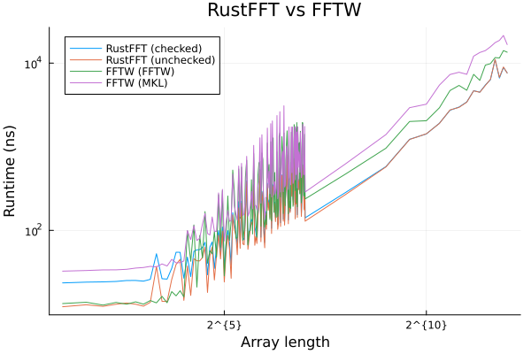
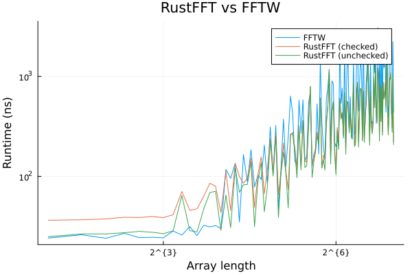
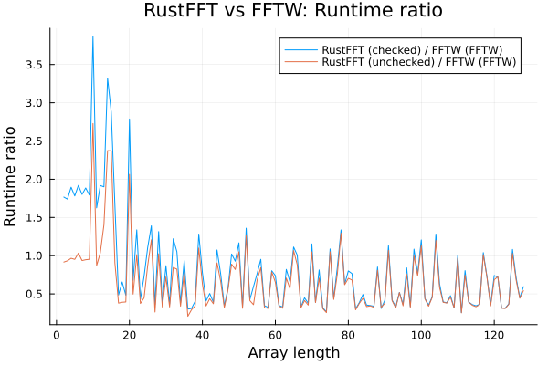

# RustFFT.jl

[](https://taaitaaiger.github.io/RustFFT.jl/dev/)

Compute FFTs in Julia using RustFFT. Some parts of this documentation have been quoted from the [RustFFT docs](https://docs.rs/rustfft/latest/rustfft/).

> RustFFT is a high-performance, SIMD-accelerated FFT library written in pure Rust. It can compute FFTs of any size, including prime-number sizes, in O(nlogn) time.

## Usage

RustFFT.jl implements the generic FFT interface of [AbstractFFTs.jl](https://juliamath.github.io/AbstractFFTs.jl/stable/api/#Public-Interface-1) but only supports one-dimensional, complex-valued arrays: `Vector{ComplexF64}` and `Vector{ComplexF32}`.

Forward and inverse FFT:

```julia
using RustFFT

data = ones(ComplexF64, 1)
fft!(instance, data)
```

```julia
using RustFFT

data = ones(ComplexF64, 1)
ifft!(instance, data)
```

You can set several options by planning the FFT:

```julia
using RustFFT

planner = new_planner(ComplexF64)
data = ones(ComplexF64, 1)
plan = plan_fft!(data; rustfft_checks=IgnoreArrayChecks(), rustfft_gcsafe=GcSafe(), rustfft_planner=planner)
plan * data
```

It's currently not possible to choose the specific algorithm that will be used to compute the transform.

## Benchmarks

RustFFT has been benchmarked against FFTW on a PC with the following specs:

OS: Ubuntu 22.04.2 LTS

CPU: AMD Ryzen 5 3600

RAM: 16GB

Julia: 1.9.2

FFTW.jl: 1.7.1

RustFFT.jl: 0.2.0

The benchmarks performed the following benchmark, with `j` ranging from 2 up to and including 128 in steps of 1, and from 256 up to and including 4096 in steps of 256:

`@btime plan * data setup = (data = ones(ComplexF64, j); plan = plan_fft!(data))`

### Runtime



### Zooming in on the first 128 entries



### `T_RustFFT / T_FFTW`


